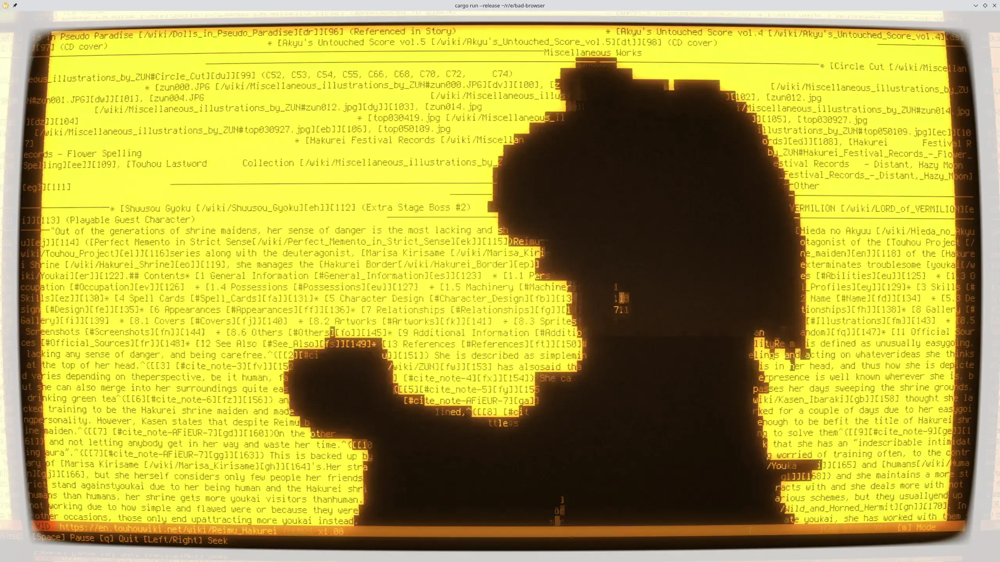
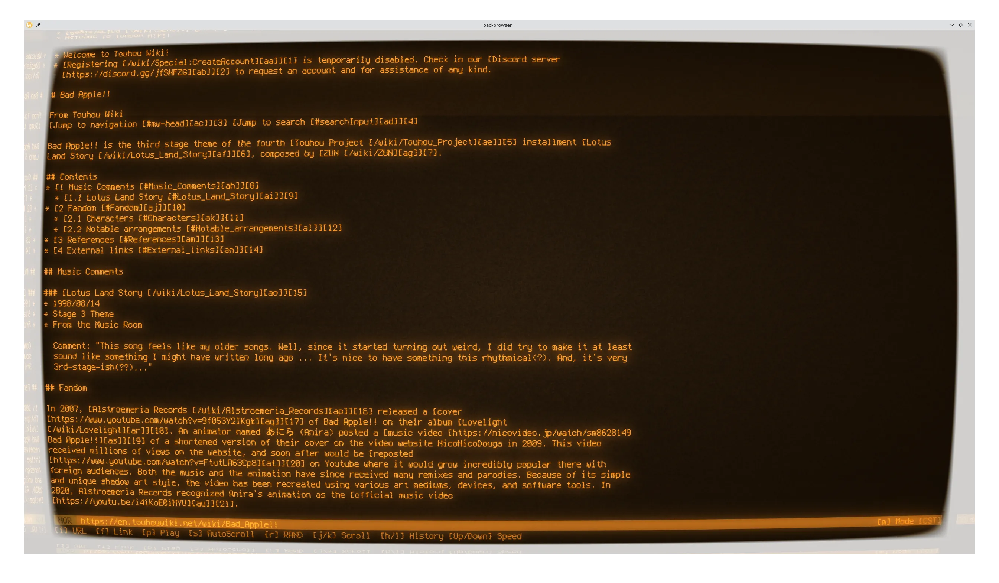

# Bad Browser!! 🍎

| [video mode][video]                         | browser mode                          |
| ------------------------------------------- | ------------------------------------- |
| [][video] |  |

**see the demo: <https://youtu.be/yZ4uIgKP9bE>**

[video]: <https://youtu.be/yZ4uIgKP9bE>

A modal TUI (Text User Interface) web browser specifically designed to play Bad Apple!!. Developed using gemini 3.0 pro and claude 4.5 sonnet.

## Requirements

- [rust](https://rust-lang.org)
- `ffmpeg` (to process the video frames)

## Usage

```bash
cargo install --path .
bad-browser --video ./path/to/video.mp4 --demo bad-apple.demo
```

### Recommended

- https://github.com/Swordfish90/cool-retro-term
- https://github.com/zevv/bucklespring

## License

[AGPL-3.0-only](./LICENSE)
